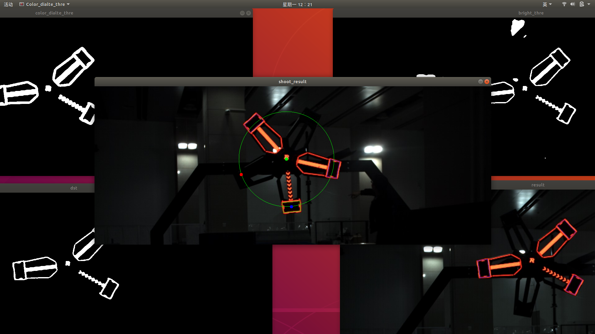

# rm_power_rune2019模块

## 1.简介

rm_power_rune2019是rmoss_contrib 中的一个功能包，为RoboMaster2019赛季的能量机关任务实现了一个简单的算法，可供参考学习。

## 2.文件说明

* 主要文件：

  |             文件             |                    功能描述                    |
  | :--------------------------: | :--------------------------------------------: |
  |          rune_def.h          |            能量机关相关数据结构定义            |
  |     rune_detection.h/cpp     |          能量机关的装甲板检测识别模块          |
  |   rune_state_machine.h/cpp   | 能量机关状态机模块，实现激活（待打击）目标选择 |
  |  rune_prediction_tool.h/cpp  | 能量机关旋转预测模块，拟合圆，与绕点旋转功能。 |
  | simple_power_rune_algo.h/cpp |   能量机关封装算法模块实现（小，大能量机关）   |
  |   task_power_rune.hpp/cpp    |           能量机关任务ROS顶层封装。            |
  
*  node文件:

  |           文件           |      功能描述       |
  | :----------------------: | :-----------------: |
  | task_power_rune_node.cpp | 能量机关任务ROS节点 |

* launch文件：

|             文件             |                  功能描述                  |
| :--------------------------: | :----------------------------------------: |
| large_power_rune_test.launch | 大能量机关任务功能测试（使用视频模拟相机） |

* script文件

|       文件        |             功能描述             |
| :---------------: | :------------------------------: |
| scripts/client.py | 设置能量机关状态（开始，暂停等） |

## 3.快速使用

#### 大能量机关测试（视频模拟相机）

> 目前不支持小能量机关

修改launch文件:launch/large_power_rune_test.launch

```python
video_path="/home/ubuntu/project/rmoss_ws/src/res/power_rune2019_red_demo.avi"
```

* 更改视频路径，将video_path改成自己能量机关视频路径
* 能量机关测试视频官方下载：[RoboMaster论坛链接](https://bbs.robomaster.com/thread-7914-1-1.html)：[百度云盘](https://pan.baidu.com/s/1OoIpbzZ2U8Qimadn3zyb6g)

launch启动

```bash
ros2 launch rm_power_rune2019 large_power_rune_test.launch.py 
```

查看相机图形

```bash
ros2 run rqt_image_view rqt_image_view
```


使用client.py启动自瞄任务

```bash
ros2 run rm_power_rune2019 client.py
```

* 按`e`启动大能量机关，按`q`暂停

debug信息（图像处理中间过程信息）



若想取消图像debug信息，可以修改配置文件res/task_power_rune_config.yaml

```yaml
get_debug : False
```

#### Rviz可视化打击点（TODO）


* 可以用于评估识别误差

### 4.能量机关算法说明

* 参考文章：[关于RoboMaster2019能量机关任务](https://www.jianshu.com/p/83b509953198)
* 能量机关状态机模块，实现激活（待打击）目标选择，补充说明文档：[doc/rune_machine_state.md](doc/rune_machine_state.md)

### 5.维护者及开源许可证

* Zhenpeng Ge,  zhenpeng.ge@qq.com

* rm_power_rune2019 is provided under MIT.