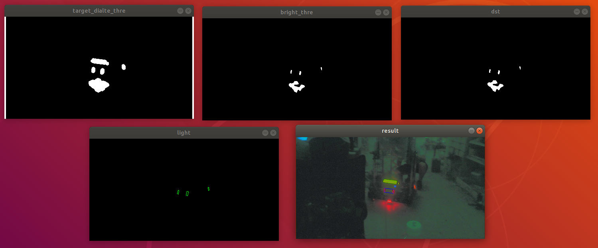

# rmoss_auto_aim模块

## 1.简介

rmoss_auto_aim模块是RoboMaster自瞄功能的一个简单实现，为步兵机器人或在其他射击机器人提供自瞄支持，通过摄像头识别敌方装甲板位置，计算出云台所需要转动的角度。

主要文件
* armor_detector.hpp/cpp : 装甲板识别模块 。
* simple_auto_aim_algo.hpp/cpp : 一个简单自瞄算法的实现, 包括装甲板识别，位置解算，预测等等。
* simple_auto_aim_node.hpp/cpp : ROS顶层模块`SimpleAutoAimNode`, 主要由`SimpleAutoAimAlgo`,`rmoss_cam::CamClient`等模块构造。
* simple_auto_aim_main.cpp : `SimpleAutoAimNode`的main入口。

## 2.快速使用

#### 自瞄测试（图片模拟相机）

launch启动

```bash
ros2 launch rmoss_auto_aim simple_auto_aim.launch.py 
```

查看相机图形

```bash
ros2 run rqt_image_view rqt_image_view
```


debug信息（图像处理中间过程信息/TODO）



若想取消图像debug信息，可以修改配置文件config/simple_auto_aim_params.yaml

```yaml
debug : False
```

### 3.自瞄算法说明

* 参考文档[doc/auto_aim_algo.md](doc/auto_aim_algo.md)

