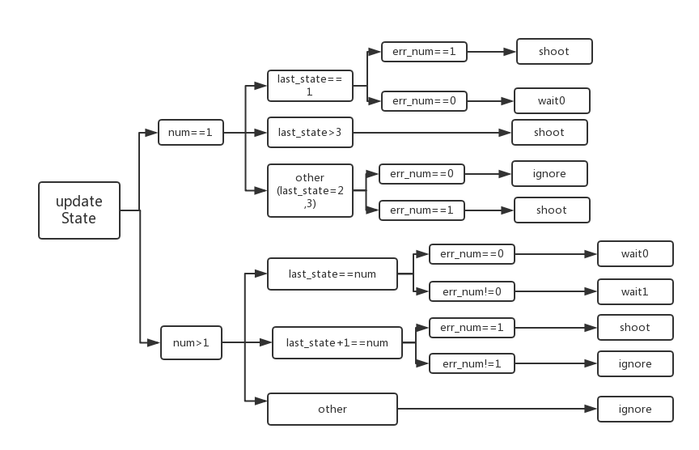

# 基于状态机的激活目标选择算法

### a.思路：

由于需要选择打击目标，最直接的思路，是根据能量机关的旋转臂的流水灯情况选择打击目标，需要对旋转臂的流水灯进行识别。这里采用另一种不需要额外识别的方法，状态机方法，新增加的亮灯装甲板作为打击目标。

* 记录当前状态，开始下一次识别，并得到新的状态，如果当前状态与新的状态误差不大，更新状态参数，但是状态保持不变。
* 采用状态。以亮灯个数作为状态个数，以每个灯的坐标作为状态参量，以最近目标的距离和为状态误差。

### b.实现细节

* 5个状态：1-5。（0代表初始化状态）
* 3个输出：shoot，wait，ignore。
* 记忆时序状态。

一些细节：

* 需要友好处理漏识别问题，方法：忽略跳过
* 需要处理好初始状态，即一个灯亮时。一个灯亮切换（1->1），一个灯量常亮，一个灯亮打错（n->1），一个灯亮漏识别。四种情况。
* 需要考虑异常，即没有捕捉目标时。

状态逻辑图

### c.测试结果：

* 算法相对稳定，对于目标选择，可以较好的处理。
* 实际测试，发现满足基本需求，在调试模式下，由于显示图片，帧率相对较低，时序跳跃太大，不能处理该情况。

* 在实践发现，激活切换灯效时刻，摄像头捕捉的图像，可能出现同时两个都处于待激活状态，状态机可以很好的处理。（如果直接基于图像，不考虑过去的状态信息，会导致错误处理）
* 需要较快的图像处理速度，保证时序跳跃幅度小，基本要求为20hz以上。

